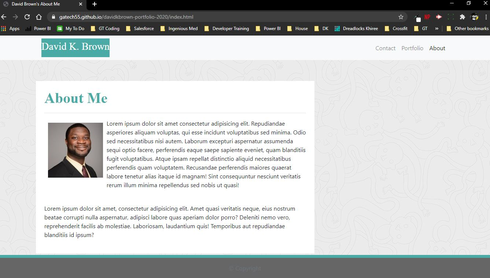
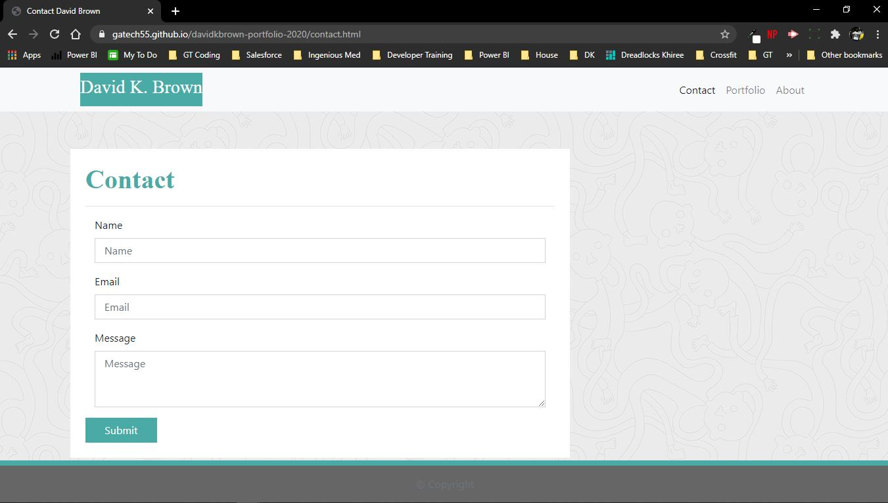
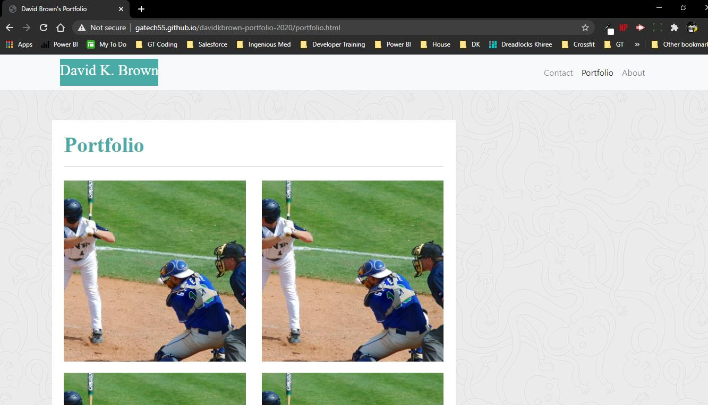

# ResponsivePortfolio

David K. Brown's 2020 Portfolio

## Table of Contents

- [Description](#description)

- [Screenshots](#screenshots)

- [Installation](#installation)

- [Credits](#credits)

- [Contributing](#contributing)

- [Copyright](#copyright)

## Description

This website was created to display information about David Brown along with his development portfolio. The portfolio will continue to be updated with new and exciting projects over time. Along with displaying his projects in a portfolio display, this website was built to be responsive using bootstrap components. The Bootstrap CDN for CSS and JavaScript was used in this project and is credited below.

## Screenshots

## Installation

To access this project you will need to visit my GitHub page and the "davidkbrown-portfolio-2020" repository. After the repository is cloned you can make edits to the project in your repository. Any questions should be directed to [David Brown](mailto:gatech55@gmail.com). The project can be found here: [davidkbrown-portfolio-2020](https://github.com/GaTech55/davidkbrown-portfolio-2020). The website can be found here: [David Brown's About Me Website](https://gatech55.github.io/davidkbrown-portfolio-2020/index.html).

## Credits

© 2019 Trilogy Education Services, a 2U, Inc. brand. All Rights Reserved.
[GitLab-02-Homework](https://gt.bootcampcontent.com/GT-Coding-Boot-Camp/gt-inc-fsf-pt-08-2020-u-c/tree/master/02-CSS-Bootstrap/02-Homework)

Copyright (c) 2011-2018 Twitter, Inc.
Copyright (c) 2011-2018 The Bootstrap Authors
[Bootstrap Website](https://getbootstrap.com/)

## Contributing

| **Commits** | **Contributor** |

| 25 | [GaTech55](https://github.com/GaTech55)|

## Copyright

Copyright (c) 2020 David Brown.
